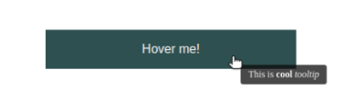

# @sounds.of.limbo/tooltip
Customizable hover tooltip for React applications

## Table of Contents
1. [Overview](#overview)
2. [Preparations](#preparations)
3. [Installation](#installation)
4. [Usage](#usage)
	1. [`Element`](#element)
		1. [Props](#props)
		2. [Example](#example)
	2. [`Display`](#display)
	3. [Customization](#customization)
		1. [Using default styles](#using-default-styles)
		2. [Customizing on your own](#customizing-on-your-own)
		3. [Smooth disappearing](#smooth-disappearing)
5. [Conclusion](#conclusion)

### Overview
Complete basic usage with comments you can find and [CodeSandbox](https://codesandbox.io/s/sol-tooltip-minimal-example-z9fh52)


## Preparations
This package is using `mobx` and `mobx-react` as peer dependencies, so before (or alognside with) installation you have to install these dependencies:
```bash
npm install --save mobx mobx-react
```

## Installation
Simply install it using NPM:
```bash
npm install --save @sounds.of.limbo/tooltip
```

## Usage
The package provides 2 React components: `Element` and `Display`

### `Element`
`Element` is component that creates a tooltipable React node. It is possible to pass `children` as usual.

#### Props
| Prop name | Type | Is required? | Default value | Notes |
|-|-|-|-|-|
| `element` | `keyof HTMLElementTagNameMap` | **YES** |  | Regular tag name, e.g. `div`, `span`, etc. |
| `elementProps` | `React.HTMLAttributes<element>` |  |  | Props for specified element (`className`, `onClick`, etc.) |
| `content` | `React.ReactNode` |  |  | Content of the tooltip. If not specified, `Element` will not have the tooltip on hover |

#### Example
Let's create simple tooltipable button

```tsx
import * as React from "react"
import { Element as TooltipElement } from "@sounds.of.limbo/tooltip"

export interface TooltipableButtonProps {
    tooltip?: React.ReactNode
    onClick?: () => void
}

export default
class TooltipableButton
extends React.Component<TooltipableButtonProps, {}> {
    render() {
        const { tooltip, onClick, children } = this.props
        return <>
            <TooltipElement
                element="button"
                elementProps={{
                    className: `c-button`,
                    onClick,
                }}
                content={tooltip}
            >
                {children}
            </TooltipElement>
        </>
    }
}
```

Now, when we want to create a button with tooltip, we just using this new component:

```tsx
import * as React from "react"
import TooltipableButton from "./some/where"

export const SomeView: React.FC = () => {
    return <>
        <section className="some-view">
            <h1>
                Terms of use
            </h1>
            <p>
                Lorem ipsum dolor sit amet consectetur adipisicing elit. Cumque nobis veritatis facere!
            </p>
            <TooltipableButton
                tooltip={<>
                    By clicking on <strong>"Accept"</strong> you are confirming that you have <i>read and accept</i> our terms of use, lol
                </>}
                onClick={() => alert("Terms of use have been accepted!")}
            >
                Accept
            </TooltipableButton>
        </section>
    <>
}
```

### `Display`
`Display` component is rendering tooltips inside itself. It should be placed as close to the application root as possible. Usually it should be rendered at entrypoint (`App.jsx`, etc.).

```tsx
import * as React from "react"
import { Display as TooltipDisplay } from "@sounds.of.limbo/tooltip"

export const App = () => {
    return <>
        <main className="app">
            <h1>
                Hello, world!
            </h1>
        </main>
        <TooltipDisplay /> {/* This is all you need for you tooltips to be shown */}
    </>
}
```

### Customization

By default, when you create minimal working code with the examples from above, you will get tooltips as just black text on transparent background.
There are two ways to customize the appearance of the tooltip.

#### Using default styles

The package provides default styles for the tooltip (white text on black semi-transparent background):



To apply this style, you have to import corresponding stylesheet in the same place where you are rendering `Display` component.
There are CSS and SASS versions of the stylesheet:
```tsx
import "@sounds.of.limbo/tooltip/styles/css/tooltip.css" // CSS version
import "@sounds.of.limbo/tooltip/styles/sass/tooltip.sass" // SASS version
```

#### Customizing on your own

There are three class names applied to the tooltip:

1. `sol__tooltip` - this is the main class name, applied always
2. `sol__tooltip-fade-in` - this class name is being applied at the time of tooltip appearing on the screen. Here you can add some fade-in animations.
3. `sol__tooltip-fade-out` - this class name is being applied at the time of tooltip is going to disappear (when the `mouseleave` event is fired). Here you can add some fade-out animations. However, this won't work until you set up fade-out animation name (see [Smooth disappearing](#smooth-disappearing))

#### Smooth disappearing

By default, tooltip will disappear on `mouseleave` event immediately, without delay. However, if you want to fade-out it smoothly, there is an option to do that.

1. Add animation for `sol__tooltip-fade-out` class:
```css
@keyframes fadeOut {
    0% { opacity: 1; }
    100% { opacity: 0; }
}

.sol__tooltip-fade-out {
    animation-name: fadeOut; /* we will use this animaton name later */
    animation-duration: 350ms;
    animation-timing-function: ease;
    animation-fill-mode: both;
}
```

2. Set specified animation name to the `fadeOutAnimationName` static property of the `Display` component. You should do this at the same place, where you render the `Display` component:
```tsx
import * as React from "react"
import { Display as TooltipDisplay } from "@sounds.of.limbo/tooltip"

TooltipDisplay.fadeOutAnimationName = "fadeOut" // here we place our animation-name from "sol__tooltip-fade-out" class

export const App = () => {
    return <>
        <main className="app">
            <h1>
                Hello, world!
            </h1>
        </main>
        <TooltipDisplay /> {/* This is all you need for you tooltips to be shown */}
    </>
}
```

That's it! Since you complete these two steps, on `mouseleave` event the `sol__tooltip-fade-out` class will be applied to the tooltip, and the `Display` component will listen to the `animationend` event, so the tooltip will actually disappear from the screen once fade-out animation is finished.

## Conclusion

Don't hesitate to visit [CodeSandbox](https://codesandbox.io/s/sol-tooltip-minimal-example-z9fh52), all cases from the above are coded and commented there, so you can play with it without additional frictions.

Any questions/proposals are welcome in the "Issues" tab.